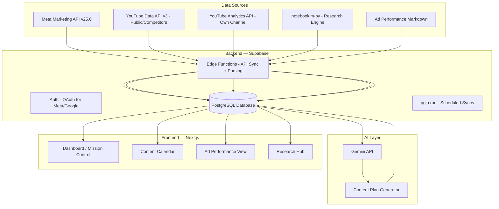

# Mission Control — Ad-Buying AI Assistant

An AI-powered web dashboard ("Mission Control") that gives your wife a single place to see **what content to create this week**, backed by deep research, ad performance analytics, and competitor insights. Built with Next.js + Supabase.

## Architecture Overview



## Content Cadence

| Content Type | Frequency | Platform |
|---|---|---|
| Short-form reels | 5/day (35/week) | Meta (IG/FB) |
| Long-form video | 1/week | YouTube |
| Ad creatives (batch) | Weekly batch | Meta Ads |

---

## Resolved Decisions

- ✅ **Meta API Access**: Confirmed — system user token available with `ads_read` + `read_insights`
- ✅ **YouTube**: Need **both** — public Data API v3 (competitors) + Analytics API with OAuth (own channel)
- ✅ **NotebookLM**: Integrate via [`notebooklm-py`](https://github.com/teng-lin/notebooklm-py) — unofficial Python API with CLI + async support
- ✅ **Tech**: Next.js web app + Supabase backend
- ✅ **Scope**: MVP first (wife's business), SaaS later

> [!WARNING]
> **notebooklm-py is unofficial** — uses undocumented Google APIs that can change without notice. Fine for personal/prototype use. If this becomes SaaS, we'll need a fallback strategy (own RAG pipeline with Gemini).

> [!IMPORTANT]
> **Scope Decision**: MVP first — working dashboard for your wife. SaaS features (multi-tenant auth, onboarding wizard, billing) deferred to Phase 2.

---

## Proposed Changes

### Phase 1 — MVP (What We Build Now)

#### 1. Dashboard (Mission Control Home)
- **Weekly overview**: Content due vs. done
- **Top-performing ads**: Quick glance at what's working
- **Today's action items**: "3 reels due today", "YouTube video due Thursday"
- **AI recommendations**: Summary from latest NotebookLM research

#### 2. Content Calendar
- **Weekly/monthly calendar view** with all content items
- **Color-coded**: Reels (purple), YouTube (red), Ads (blue)
- **Each item**: Title/hook, platform, status (planned → in-progress → created → published)
- **AI-generated briefs**: Hook, key points, CTA — all informed by research
- **Drag and drop** to reschedule

#### 3. Ad Performance
- **Campaign cards**: Key metrics (spend, ROAS, CTR, conversions)
- **Status badges**: 🟢 Scale, 🟡 Monitor, 🔴 Kill, ⏸️ Pause
- **AI analysis**: Why the recommendation was made
- **Trend charts**: Performance over time
- *Phase 1*: Parsed from existing markdown files
- *Phase 2*: Live Meta API integration

#### 4. Research Hub
- **NotebookLM integration** via `notebooklm-py`:
  - Create/manage notebooks from the dashboard
  - Add sources (URLs, PDFs, YouTube videos)
  - Run research queries ("What hooks work for fitness content?")
  - Generate quizzes, flashcards, and summaries
- **Research insights** organized by topic (hooks, trends, competitors)
- **Actionable takeaways**: Bullet points to act on

---

### Database Schema (Supabase)

#### [NEW] Migration: `create_mission_control_tables`

```sql
-- Content planning
CREATE TABLE content_plans (
  id UUID PRIMARY KEY DEFAULT gen_random_uuid(),
  week_start DATE NOT NULL,
  week_end DATE NOT NULL,
  status TEXT DEFAULT 'draft', -- draft, active, completed
  created_at TIMESTAMPTZ DEFAULT now(),
  updated_at TIMESTAMPTZ DEFAULT now()
);

CREATE TABLE content_items (
  id UUID PRIMARY KEY DEFAULT gen_random_uuid(),
  plan_id UUID REFERENCES content_plans(id) ON DELETE CASCADE,
  title TEXT NOT NULL,
  content_type TEXT NOT NULL, -- reel, youtube_long, ad_creative
  platform TEXT NOT NULL, -- meta, youtube, tiktok
  scheduled_date DATE,
  status TEXT DEFAULT 'planned', -- planned, in_progress, created, published
  hook TEXT,
  key_points JSONB,
  cta TEXT,
  research_refs JSONB,
  notes TEXT,
  created_at TIMESTAMPTZ DEFAULT now(),
  updated_at TIMESTAMPTZ DEFAULT now()
);

-- Ad performance tracking
CREATE TABLE ad_performance (
  id UUID PRIMARY KEY DEFAULT gen_random_uuid(),
  campaign_name TEXT NOT NULL,
  ad_name TEXT,
  platform TEXT DEFAULT 'meta',
  spend NUMERIC(10,2),
  impressions INTEGER,
  clicks INTEGER,
  conversions INTEGER,
  roas NUMERIC(6,2),
  ctr NUMERIC(6,4),
  status TEXT, -- scale, monitor, kill, pause
  ai_analysis TEXT,
  date_range_start DATE,
  date_range_end DATE,
  raw_data JSONB,
  created_at TIMESTAMPTZ DEFAULT now()
);

-- Research from NotebookLM / OpenClaw
CREATE TABLE research_insights (
  id UUID PRIMARY KEY DEFAULT gen_random_uuid(),
  notebook_id TEXT, -- NotebookLM notebook ID (for linking back)
  topic TEXT NOT NULL, -- hooks, trends, competitor, strategy
  title TEXT NOT NULL,
  content TEXT NOT NULL,
  source TEXT,
  actionable_takeaways JSONB,
  tags JSONB,
  created_at TIMESTAMPTZ DEFAULT now()
);

-- NotebookLM notebook tracking
CREATE TABLE notebooklm_notebooks (
  id UUID PRIMARY KEY DEFAULT gen_random_uuid(),
  notebook_id TEXT NOT NULL UNIQUE, -- NotebookLM's internal ID
  name TEXT NOT NULL,
  purpose TEXT, -- what this notebook researches
  source_count INTEGER DEFAULT 0,
  last_synced_at TIMESTAMPTZ,
  created_at TIMESTAMPTZ DEFAULT now()
);

-- Competitor tracking
CREATE TABLE competitors (
  id UUID PRIMARY KEY DEFAULT gen_random_uuid(),
  name TEXT NOT NULL,
  platform TEXT NOT NULL,
  channel_url TEXT,
  notes TEXT,
  created_at TIMESTAMPTZ DEFAULT now()
);
```

---

### Frontend (Next.js App)

#### [NEW] Project setup with `create-next-app`
- Next.js 15 with App Router
- Supabase SSR (`@supabase/ssr`)
- CSS modules (clean, no Tailwind)
- Recharts for charts
- Lucide icons

#### [NEW] Key pages
| Route | Purpose |
|---|---|
| `/` | Dashboard — mission control overview |
| `/calendar` | Content calendar — weekly/monthly |
| `/ads` | Ad performance dashboard |
| `/research` | Research hub — NotebookLM integration |
| `/upload` | Upload ad performance markdown + research files |

---

### Data Flow

#### Phase 1 (MVP)
1. **Ad performance**: Upload markdown → edge function parses → `ad_performance` table
2. **Research**: `notebooklm-py` CLI/API → extract insights → `research_insights` table
3. **Content plan**: Gemini generates weekly plan from research + ad data → `content_plans` + `content_items`
4. **YouTube competitors**: YouTube Data API v3 (public) → `competitors` table

#### Phase 2 (Automated)
1. **Meta API**: Scheduled sync via edge function + pg_cron → live ad data
2. **YouTube Analytics**: OAuth flow → own channel analytics
3. **NotebookLM pipeline**: Automated research → scheduled insight extraction
4. **SaaS features**: Multi-tenant auth, onboarding, billing

---

## Verification Plan

### Browser Testing
1. Dashboard loads with summary cards, action items, AI recommendations
2. Content calendar shows items by week, supports create/update status
3. Ad performance cards render with metrics and status badges
4. Research hub displays insights, filterable by topic
5. File upload parses markdown and populates correct tables

### Manual Verification (Master Rob)
1. Upload actual ad performance markdown → confirm correct parsing
2. Run `notebooklm-py` CLI to pull research → confirm insights display
3. Review AI-generated weekly content plan for accuracy
4. Have your wife test the dashboard for usability feedback
